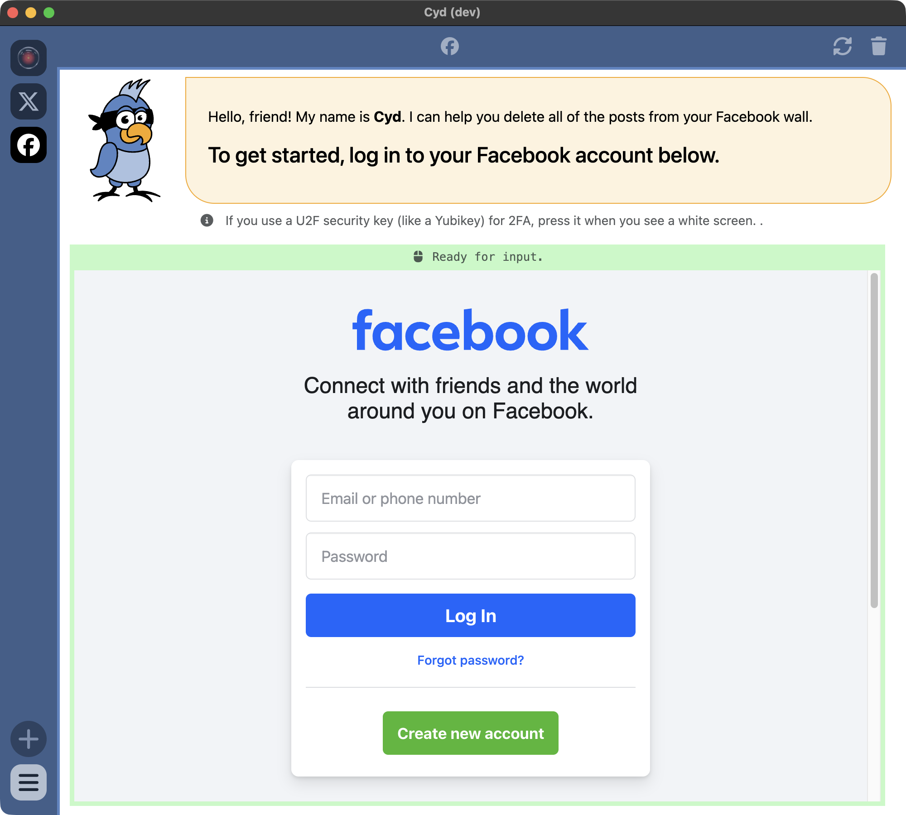

:::warning[Beta Feature]

These features are under beta testing right now and not available in the latest release.

:::

# Sign In to Facebook

When you're on the new account screen in Cyd, choose the Facebook platform. You'll see the following screen:

Cyd (the bird) is at the top of the window giving you instructions, and the bottom part of the window is Cyd's embedded web browser.

:::tip The Cyd server doesn't have any access to your password or your data
When you sign into your Facebook account within Cyd's embedded browser, it's the same as signing in using any other browser on your computer: **Your password is sent directly from your computer to Facebook's servers and it's encrypted using HTTPS. Cyd's server doesn't collect your password or have any access to your account.** Only the Cyd app running locally on your computer does.
:::

Go ahead and sign in to your Facebook account using your username and password.

After you sign in, Cyd will immediately start driving your browser to determine your username, your profile picture. When it's done, you'll end up at the Dashboard screen. Continue to [Dashboard](./dashboard).
