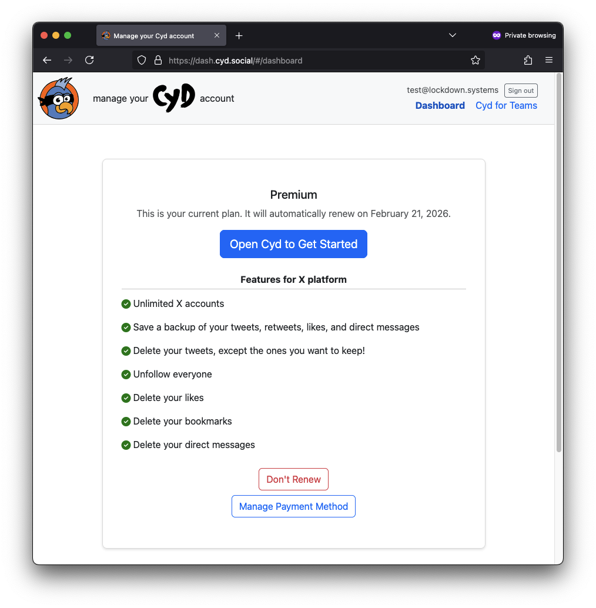

# Manage Your Plan

You can manage your Premium plan from the [Cyd Dashboard](https://dash.cyd.social/).

After signing in with your email address, the dashboard will look like this:

## Disable Automatic Renewal

If you just want to use Cyd once and then not renew your Premium plan in a year, click **Don't Renew**.

Your Premium plan will continue to be active until a year after you paid for it, and then you'll get downgraded to a free plan. You can always choose to enable automatic renewal again if you'd like.

## Update Payment Method

From the Cyd Dashboard, click the **Manage Payment Method** button to update your payment method.

## Download Receipts

If you scroll down to the bottom of the Cyd Dashboard, you can find all of your receipts available for download.
